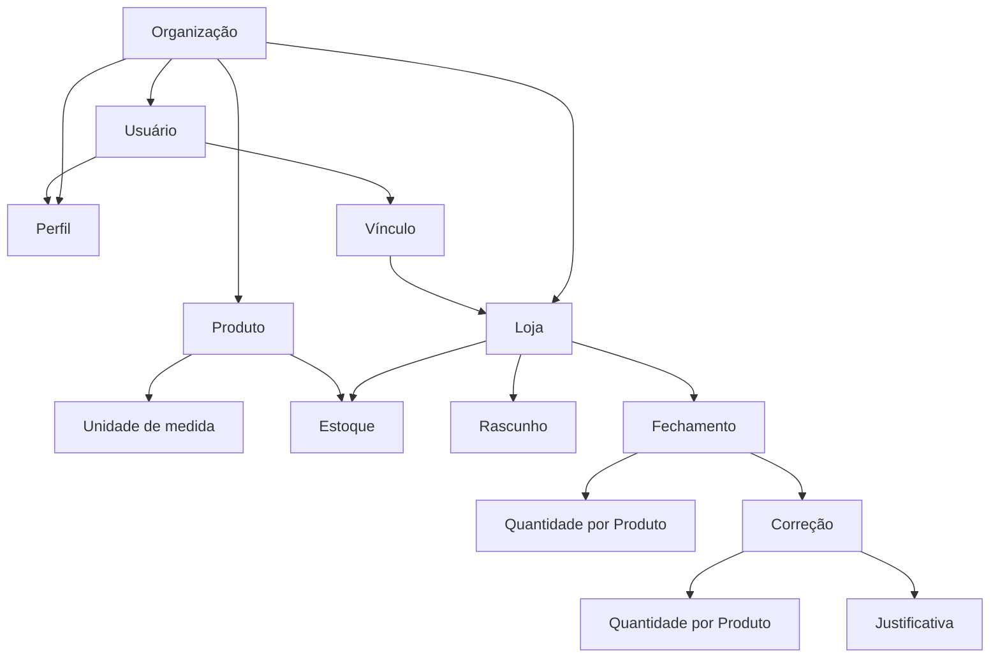

# Doguinho do Corujá – Product Research

Pesquisa congelada em 2026-09-10. Refinamentos posteriores podem alterar premissas marcadas como **ASSUMPTION** ou **UNKNOWN**. Itens **CONFIRMED** foram respondidos no grill.

Legenda: **CONFIRMED** · **ASSUMPTION** · **UNKNOWN**

## 1. Product Summary

Doguinho do Corujá é um sistema web de controle de Estoque para uma **Organização** com várias **Lojas** (inicialmente 3; podem abrir mais). Operadores informam a **quantidade restante** de cada **Produto ativo** no **encerramento** do dia. O **Dono** vê todas as Lojas, o catálogo, o histórico e um dashboard central. Acesso pelo navegador, priorizando celular.

Não é PDV, não é ERP, não mede venda nem dinheiro.

## 2. Problem

Hoje o encerramento não está centralizado num sistema com autorização e histórico. Cada Loja precisa de Estoque próprio; o Dono precisa saber se a Loja fechou o dia, o que restou, e quem mudou o número. Operador de uma Loja não pode ver ou alterar Estoque de outra sem Vínculo.

## 3. Confirmed Commercial Scope

**CONFIRMED**

- 3 Lojas no início; Estoque separado por Loja.
- Dono: todas as Lojas, Produtos, operadores/usuários, histórico, dashboard.
- Operadores autenticam, veem e fecham só Lojas do Vínculo.
- Cadastro e edição de Produto; unidade de medida.
- Fechamento no encerramento (1 por dia operacional).
- Histórico de atualizações.
- App responsivo (mobile / tablet / desktop).

**CONFIRMED (cardápio de exemplo, lista incompleta):** milho, ervilha, tomate, cebola, maionese, mostarda, salsicha, pão, molho de tomate, e outros ainda não listados. Escala esperada: dezenas de Produtos, não centenas.

Fora deste produto (salvo confirmação futura): venda, PDV, pedido, cliente, fornecedor, pagamento, NF, financeiro, compra, entrega, CRM.

## 4. Actors

| Ator | Status | Definição |
|------|--------|-----------|
| Organização | CONFIRMED | Doguinho do Corujá. Dona das Lojas e do catálogo. |
| Dono | CONFIRMED | Papel de sistema. Todas as Lojas. Não rebaixável pelo checklist. Não remove o próprio acesso se for o último Dono. |
| Operador | CONFIRMED | Usuário com Vínculo a uma ou mais Lojas. |
| Perfil | CONFIRMED | Conjunto nomeado de permissões criado pelo Dono via checklist. Não substitui o Dono. |
| Equipe do dono (papel de sistema) | CONFIRMED fora do MVP | Não precisa agora. |

**ASSUMPTION (Q25):** “Operador” é Perfil inicial (template), editável, não apagável enquanto houver usuário nele. Dono permanece papel de sistema.

**UNKNOWN (Q24):** se pode existir segundo Dono como backup de senha.

## 5. Main Operational Workflow

1. Dono (semente) acessa a Organização.
2. Dono cadastra Lojas e Produtos ativos (nome + unidade de medida).
3. Dono cria Perfis e usuários (e-mail + senha inicial), com Vínculo de Lojas.
4. Durante o dia o Estoque oficial é o último Fechamento enviado (ou “nunca fechou”).
5. No encerramento, o Operador abre o Rascunho da Loja, informa quantidade restante de **todo** Produto ativo, envia.
6. O envio vira Fechamento; aquele conjunto de números vira Estoque.
7. Se errou, lança Correção no mesmo dia calendário, catálogo inteiro, com Justificativa obrigatória.
8. Dono consulta dashboard, Estoque das três Lojas e histórico.

## 6. End-of-Shift Inventory Workflow

**CONFIRMED**

- O número informado é **quantidade restante** (contagem física), não consumo nem movimento.
- Todo Produto **ativo** entra no Fechamento. Cadastrado (ativo) = fecha.
- 1 Fechamento no encerramento por Loja por dia calendário.
- O número enviado **substitui** o Estoque oficial; o valor anterior permanece no histórico.
- Primeiro envio do dia: sem Justificativa.
- Segundo envio no mesmo dia: **Correção**, Justificativa obrigatória, catálogo inteiro outra vez.
- Sem fechar dia passado no MVP.
- Sem estado `não operou` no MVP (futuro). Se a Loja não abrir, o alerta de falta pode disparar; o Dono convive com isso até o refinamento.
- Um Rascunho por Loja por dia. Enviar o Rascunho vira Fechamento.
- Online obrigatório. Progresso do Rascunho persiste no servidor. Enviar é idempotente.
- Rascunho abandonado **não** vira Estoque. Dono vê “sem Fechamento hoje”.

**ASSUMPTION (Q25, Q27, Q28):** ver seções 14 e 19.

## 7. Domain Model

Entidades justificadas pelo domínio (não inventar ERP):

| Entidade | Papel | Status |
|----------|--------|--------|
| Organização | Isolamento interno (`organization_id`). Sem UI de tenant. | CONFIRMED |
| Loja | Fronteira de Estoque. | CONFIRMED |
| Usuário | Pessoa autenticável. | CONFIRMED |
| Dono | Papel de sistema. | CONFIRMED |
| Perfil | Checklist de permissões. | CONFIRMED |
| Vínculo | Usuário × Lojas. | CONFIRMED |
| Produto | Catálogo da Organização. | CONFIRMED |
| Unidade de medida | Lista fechada no Produto. | CONFIRMED |
| Estoque | Quantidade oficial Produto × Loja. | CONFIRMED |
| Rascunho | Fechamento não enviado, 1 por Loja/dia. | CONFIRMED |
| Fechamento | Declaração enviada. | CONFIRMED |
| Correção | Fechamento posterior no mesmo dia, com Justificativa. | CONFIRMED |

Unidades **CONFIRMED:** unidade, kg, g, L, mL, pacote. A unidade vive no Produto; o Fechamento só pede número.

## 8. Entity Relationships

O Dono não aparece como Vínculo: alcance implícito a todas as Lojas da Organização.

## 9. Organization / Store Ownership Model

**CONFIRMED (Q10 A)**

- 1 Organização, N Lojas.
- Loja nova entra na mesma Organização, mesmo catálogo, mesmo Dono.
- Tenant interno = Organização. Sem tela SaaS de tenants no MVP.
- Recurso de Loja exige `store_id` **e** autorização (Vínculo ou Dono). ID válido no payload não basta.
- Recurso da Organização exige pertencer à Organização da sessão.

**CONFIRMED fora:** tenant por Loja; multi-empresa no MVP.

## 10. Authentication Model

**CONFIRMED (Q19)**

- Sem cadastro público.
- Dono semente.
- Dono cria usuários: e-mail + senha inicial.
- Sem verificação de e-mail no MVP.
- Desligar usuário invalida a sessão no próximo request.

**UNKNOWN / adiado (Q24):** recuperação de senha, TTL de sessão, segundo Dono, dois aparelhos simultâneos. Refinamento posterior. Até lá, implementação deve usar defaults seguros de sessão e hash de senha (ver `security/`), sem inventar self-service de reset como requisito de negócio confirmado.

## 11. Authorization Model

Cadeia: **Usuário → Dono ou Perfil → Organização → Vínculo (Lojas) → Recurso → Ação**.

**CONFIRMED**

- Autorização no servidor. Esconder botão no celular não é controle.
- Lojas do checklist: **não**. Loja = Vínculo (modelo A).
- Dono: todas as Lojas; não rebaixável pelo checklist; não autoexclui se for o último.
- Operador: só Lojas do Vínculo.
- Perfil com checklist no MVP. Lista de permissões aceita (Q20 B).

**ASSUMPTION (Q25)**

- Fora do checklist (só Dono): criar/editar Perfil, criar Loja, rebaixar Dono.
- No checklist: ver Estoque, Fechamento, Correção, histórico, dashboard, Produto, criar/desligar usuário.
- Sem Loja no Vínculo e sem ser Dono: autentica, não envia Fechamento.
- “Ver Loja fora do Vínculo” não é permissão: o Vínculo *é* a lista.

## 12. Permission Matrix

Legenda: **C** = CONFIRMED · **A** = ASSUMPTION (default de trabalho) · **—** = não aplica

| Recurso | Ação | Dono | Operador (perfil típico) | Perfil custom |
|---------|------|------|--------------------------|---------------|
| Estoque | Ler Lojas do Vínculo | C sim (todas) | C sim | C checkbox |
| Estoque | Ler Loja fora do Vínculo | C sim | C não | C não (sem checkbox) |
| Fechamento | Enviar | C sim | C sim (Vínculo) | C checkbox |
| Correção | Enviar | C sim | C sim (Vínculo) | C checkbox |
| Histórico | Ler | C tudo | C Loja do Vínculo, ao menos o próprio dia | C checkbox |
| Dashboard | Ver | C sim | A checkbox, default não | C checkbox |
| Produto | Ler | C sim | A sim (precisa fechar) | C checkbox |
| Produto | Criar/editar/desativar | C sim | C não | C checkbox |
| Usuário | Criar/desligar | C sim | C não | C checkbox |
| Perfil | Criar/editar | C sim | C não | A não (fora do checklist) |
| Loja | Criar | C sim | C não | A não (fora do checklist) |
| Dono | Rebaixar / criar Dono | C último Dono intocável | C não | A não |

## 13. Product Rules

**CONFIRMED**

- Catálogo único da Organização; as Lojas fecham os mesmos Produtos.
- Campos MVP: nome + unidade de medida.
- Lista de unidades fechada (unidade, kg, g, L, mL, pacote).
- Desativar, não apagar.
- Todo Produto ativo entra no Fechamento de cada Loja.

**ASSUMPTION (Q28):** nome único na Organização. Produto cadastrado no meio do dia entra no Rascunho/Correção ainda aberto; se o dia já fechou sem nova Correção, só no dia seguinte.

**CONFIRMED fora do MVP:** categoria, SKU, foto, sortimento por Loja.

## 14. Inventory Rules

**CONFIRMED**

- Estoque = quantidade restante do último Fechamento/Correção enviado.
- Independente por Loja.
- 0 é quantidade possível na operação (item acabou) — **ASSUMPTION (Q27)** elevada a default de trabalho.
- Negativo recusado. **ASSUMPTION (Q27)**
- Enviar com item ativo vazio bloqueia o Fechamento inteiro. **ASSUMPTION (Q27)**
- kg/L: até 3 casas decimais; unidade/pacote: inteiro. **ASSUMPTION (Q27)**
- Teto alto só para lixo de teclado (ex. 99999). **ASSUMPTION (Q27)**
- Sem Fechamento prévio: não inventar 0 como Estoque oficial. **ASSUMPTION (Q28)**
- Concorrência do primeiro envio: um Rascunho compartilhado. Depois de enviado, novo envio = Correção (Justificativa).

## 15. Historical / Audit Rules

**CONFIRMED**

- Fechamento original permanece após Correção.
- Registro mínimo: Loja, data, hora, usuário responsável.
- Por Produto: quantidade anterior + nova. Diferença calculada, não persistida como fato separado.
- Justificativa só na Correção.
- Distinguir Fechamento vs Correção.
- Dono vê tudo. Operador vê Loja do Vínculo (ao menos o próprio dia).
- Rascunho não enviado não entra no histórico de Estoque.

**ASSUMPTION (Q28):** histórico de usuário desligado permanece com a identidade da época.

**CONFIRMED:** não editar Fechamento no lugar.

## 16. CRUD Matrix

| Entidade | Create | Read | Update | Delete / archive | Dono dos dados |
|----------|--------|------|--------|------------------|----------------|
| Organização | Fora do produto (semente) | Dono | Fora do MVP | Fora | Plataforma / semente |
| Loja | Dono | Dono; Operador a do Vínculo | Dono | UNKNOWN / não apagar no MVP | Organização |
| Usuário | Dono (e Perfil com checkbox, A) | Dono | Dono (desligar) | Desligar, não apagar | Organização |
| Perfil | Dono | Dono | Dono | UNKNOWN se há usuários nele | Organização |
| Produto | Dono (checkbox A) | Quem fecha / Dono | Dono | Desativar | Organização |
| Estoque | Derivado do Fechamento | Conforme matriz | Só via Fechamento/Correção | — | Loja |
| Rascunho | Implícito no dia | Quem pode fechar a Loja | Autosave | Some ao enviar ou no virar do dia (A) | Loja |
| Fechamento | Quem tem permissão na Loja | Histórico | Imutável | Proibido | Loja |
| Correção | Quem tem permissão, mesmo dia | Histórico | Imutável | Proibido | Loja |

## 17. Business Invariants

### INVARIANT-001

Rule: Quantidade restante não pode ser negativa.

Reason: Contagem física não é negativa.

Enforcement: Application · Database (CHECK) · Test

Status: **ASSUMPTION** (Q27)

### INVARIANT-002

Rule: Só Dono ou usuário com Vínculo (e permissão de Fechamento) atualiza Estoque da Loja.

Reason: Operador de Centro não fecha Praia.

Enforcement: Application · Authorization · Test

Status: **CONFIRMED**

### INVARIANT-003

Rule: Todo Fechamento e Correção identificam o usuário autenticado, a Loja, data e hora.

Reason: Auditoria operacional.

Enforcement: Application · Database (NOT NULL, FK) · Test

Status: **CONFIRMED**

### INVARIANT-004

Rule: Fechamento enviado é imutável. Correção é novo registro.

Reason: O “18” não pode desaparecer depois que virou 16.

Enforcement: Application · Database (sem UPDATE de linhas de quantidade) · Test

Status: **CONFIRMED**

### INVARIANT-005

Rule: Correção exige Justificativa não vazia e só no mesmo dia calendário, no MVP.

Reason: Pedido explícito de correção auditável, sem reabrir o passado.

Enforcement: Application · Database · Test

Status: **CONFIRMED**

### INVARIANT-006

Rule: Fechamento (e Correção) cobre todos os Produtos ativos da Organização. Envio parcial é recusado.

Reason: Cadastrado ativo = fecha.

Enforcement: Application · Test

Status: **CONFIRMED** (cobertura) + **ASSUMPTION** (vazio bloqueia o lote)

### INVARIANT-007

Rule: Estoque oficial de (Loja, Produto) = última quantidade enviada para esse par. Sem envio, não há Estoque oficial.

Reason: Substituição, não movimento.

Enforcement: Application · Database · Test

Status: **CONFIRMED** + **ASSUMPTION** no “nunca fechou”

### INVARIANT-008

Rule: Há no máximo um Rascunho aberto por Loja por dia calendário.

Reason: Dois primeiros envios em paralelo.

Enforcement: Application · Database (unique) · Test

Status: **CONFIRMED**

### INVARIANT-009

Rule: Produto não é apagado se existir histórico. Só desativação.

Reason: Integridade do histórico.

Enforcement: Application · Database · Test

Status: **CONFIRMED**

### INVARIANT-010

Rule: Recurso pertence a uma Organização; Loja-owned também tem `store_id`. A sessão tem de corresponder.

Reason: Isolamento. IDOR.

Enforcement: Authorization · Database (FK) · Test

Status: **CONFIRMED**

### INVARIANT-011

Rule: Unidade de medida do número no Fechamento é a do Produto, lista fechada.

Reason: Comparar Lojas.

Enforcement: Application · Database · Test

Status: **CONFIRMED**

### INVARIANT-012

Rule: Existe pelo menos um Dono. O último Dono não perde o papel por checklist nem por autoexclusão.

Reason: Lockout da Organização.

Enforcement: Application · Database · Test

Status: **CONFIRMED**

## 18. Security Analysis

Ameaça e controle. Sem procedimento de ataque. Detalhe em `security/`.

### SEC-001

Threat: IDOR / BOLA entre Lojas.

Attack scenario: Operador autenticado na Loja A troca o identificador da Loja B na URL ou no body.

Impact: Lê ou altera Estoque de outra Loja.

Required control: Autorização server-side: Dono ou Vínculo + permissão. 403 se falhar. ASVS V8.2, V8.4.

Verification: Teste de request autenticado como Operador A contra recurso da Loja B.

### SEC-002

Threat: Escalada vertical via Perfil.

Attack scenario: Perfil ganha “criar Perfil” e se promove a equivalente de Dono.

Impact: Controle da Organização.

Required control: Criar/editar Perfil fora do checklist. ASVS V8.2, V8.3.

Verification: **ASSUMPTION** até o refinamento do Q25. Teste: Perfil sem essa ação recebe 403.

### SEC-003

Threat: Cadastro público / enumeração de usuários.

Attack scenario: Estranho se registra ou descobre e-mails válidos.

Impact: Acesso a quantidade restante.

Required control: Sem signup público. Mensagens de login genéricas. ASVS V6.3.

Verification: Rotas de registro inexistentes para anônimo.

### SEC-004

Threat: Sessão de usuário desligado continua válida.

Attack scenario: Operador demitido com celular ainda logado.

Impact: Fecha ou lê Estoque.

Required control: Desligar invalida sessão no próximo request. ASVS V7.4, V8.3.

Verification: Após disable, próximo request autenticado falha.

### SEC-005

Threat: Mass assignment no Fechamento (loja_id, usuário, timestamps).

Attack scenario: Body inclui outra Loja ou outro autor.

Impact: Histórico falso.

Required control: Schema estrito; Loja e autor vêm da sessão + rota autorizada. ASVS V2.2, V8.2.

Verification: Campos extras ignorados ou 400; autor ≠ body.

### SEC-006

Threat: Quantidade malformada (negativo, texto, overflow).

Attack scenario: Payload manipulado.

Impact: Estoque inválido.

Required control: Validação server-side. ASVS V2.2, V2.3.

Verification: 400 em negativo / tipo inválido.

### SEC-007

Threat: Replay / duplo Enviar.

Attack scenario: Dois cliques ou retry de rede.

Impact: Dois Fechamentos “primeiros” ou Correção sem Justificativa.

Required control: Idempotência do Enviar; segundo primeiro-envio vira regra de Correção. ASVS V2.3, V15.4.

Verification: Dois POSTs iguais = um Fechamento.

### SEC-008

Threat: XSS em nome de Produto ou Justificativa.

Attack scenario: Texto renderizado no dashboard.

Impact: Sessão do Dono.

Required control: Encoding na saída; Justificativa como texto. ASVS V1.2, V3.2.

Verification: Payload de script aparece literal.

### SEC-009

Threat: SQL injection.

Attack scenario: Busca/filtro concatenado.

Impact: Dados da Organização.

Required control: Queries parametrizadas (Prisma/Kysely/SQL tagged). ASVS V1.2.

Verification: SAST + testes de input.

### SEC-010

Threat: CSRF em cookie de sessão.

Attack scenario: Site terceiro dispara Enviar.

Impact: Fechamento forjado.

Required control: SameSite cookies + origem; Next.js CSRF conforme sessão. ASVS V3.3, V3.5.

Verification: Request cross-site sem token/origem falha.

## 19. Edge Cases

| Caso | Tratamento | Status |
|------|------------|--------|
| Primeiro uso, Loja sem Fechamento | Sem Estoque oficial; não inventar 0 | A |
| Catálogo vazio | Não há o que fechar; Dono cadastra Produto | C implícito |
| Produto novo no meio do dia | Entra no Rascunho/Correção aberto; senão amanhã | A |
| Produto sem Estoque ainda | “Nunca fechou”, não 0 | A |
| Zero | Válido | A |
| Nome duplicado | Recusar | A |
| Operador sem Loja | Autentica, não fecha | A |
| Usuário desligado, sessão aberta | Próximo request recusa | C |
| Quantidade errada | Correção no dia | C |
| Dois operadores no encerramento | Um Rascunho; segundo envio = Correção | C |
| Produto desativado | Fora do próximo Fechamento; histórico intacto | C |
| Rede cai | Online obrigatório; Rascunho no servidor | C |
| Duplo submit | Idempotente | C |
| URL de outra Loja | 403 | C |
| Loja desabilitada | UNKNOWN | U |
| Histórico de usuário inativo | Permanece | A |
| Domingo / não abriu | Alerta de falta pode disparar; `não operou` futuro | C |
| Dia passado | Não fecha no MVP | C |

## 20. Non-functional Requirements

**ASSUMPTION** alinhada ao negócio real (não Big Tech):

- Usuários: dezenas no máximo (1+ Dono, poucos Operadores por Loja).
- Lojas: 3 agora, poucas a mais.
- Produtos: dezenas (lista de ingredientes + outros).
- Frequência: 1 Fechamento por Loja por dia + Correções ocasionais.
- Disponibilidade: horário comercial + encerramento noturno; Vercel + Neon.
- Performance: Fechamento de dezenas de linhas no celular em rede comum.
- Retenção: histórico indefinido no MVP (**UNKNOWN** prazo legal).
- Observabilidade: logs de authz e envio de Fechamento (ver `security/`).
- Backup: responsabilidade da hospedagem Neon/Vercel no MVP.

**UNKNOWN:** RTO/RPO explícitos, retenção jurídica.

## 21. Confirmed MVP

- Auth interna, sem signup público.
- Dono semente; CRUD de usuários (e-mail + senha inicial).
- Perfil com checklist (lista da seção 12).
- Vínculo usuário–Lojas.
- 3+ Lojas na mesma Organização.
- Produto: nome, unidade, ativo/desativo.
- Fechamento de quantidade restante, catálogo ativo completo, 1 Rascunho, mobile-first, online, autosave.
- Correção mesmo dia, Justificativa, catálogo inteiro, histórico imutável.
- Dashboard Dono: falta de Fechamento, Estoque atual, envios recentes (**ASSUMPTION** Q26 A+B+C).
- Histórico com anterior/nova, autor, Loja, tempo.
- Responsivo.

## 22. Future / Possible Features

- Estado `não operou` / calendário de fechamento da Loja.
- Equipe do dono como papel de sistema (não precisa agora).
- Recuperação de senha, MFA, verificação de e-mail (Q24 adiado).
- Sortimento por Loja.
- Categoria, SKU, foto, busca avançada.
- Correção de item único (rejeitado no MVP).
- Fechar dia passado.
- Fila offline no aparelho.
- Construtor de permissão incluindo Loja no checkbox (rejeitado).
- Multi-empresa (SaaS para outros negócios).
- KPIs financeiros / “mais vendido”.

## 23. Explicitly Out of Scope

Venda, PDV, pedidos, clientes, fornecedores, pagamentos, NF, dashboard financeiro, contabilidade, compras, entrega, billing, CRM, microserviços, Kafka, Redis, filas, Kubernetes, backend separado.

## 24. Decisions

### DECISION-001

Context: Como o operador atualiza Estoque.

Decision: Quantidade restante absoluta; substitui o Estoque.

Reason: Sem PDV não há consumo confiável.

Trade-off: Não há rastreio de entrada de mercadoria.

Status: **CONFIRMED** · ADR-0001

### DECISION-002

Context: Catálogo vs sortimento.

Decision: Um catálogo; toda Loja fecha todo Produto ativo.

Reason: “Produto cadastrado é o que fecha.” Lojas com o mesmo mix.

Trade-off: Loja que não usa um item informa 0 (default A).

Status: **CONFIRMED**

### DECISION-003

Context: Isolamento.

Decision: Uma Organização, N Lojas. Tenant ≠ Loja.

Reason: Um Dono, dashboard central, 4ª loja no mesmo dono.

Trade-off: Sem SaaS multi-empresa no MVP.

Status: **CONFIRMED** · ADR-0002

### DECISION-004

Context: Erro depois de enviar.

Decision: Correção = novo lançamento, Justificativa obrigatória, original permanece, mesmo dia, catálogo inteiro.

Reason: Auditoria. Fechamento parcial reabre a recusa do catálogo completo.

Trade-off: Corrigir um pão implica reenviar a lista.

Status: **CONFIRMED**

### DECISION-005

Context: Papéis.

Decision: Dono de sistema + Perfil com checklist. Loja no Vínculo, não no checklist.

Reason: Pedido explícito Q20 B; IDOR se Loja for checkbox.

Trade-off: IAM no MVP. Premissa: criar Perfil fora do checklist.

Status: **CONFIRMED** (existência) · **ASSUMPTION** (o que fica fora do checklist) · ADR-0004

### DECISION-006

Context: Produto com histórico.

Decision: Desativar, nunca apagar.

Reason: Integridade.

Trade-off: Catálogo acumula inativos.

Status: **CONFIRMED** · ADR-0003

### DECISION-007

Context: Rede e rascunho.

Decision: Online; autosave servidor; um Rascunho; Enviar idempotente; rascunho ≠ Estoque.

Reason: Celular no encerramento, sem produto offline.

Trade-off: Sem internet não fecha.

Status: **CONFIRMED**

## 25. Remaining Questions

1. Recuperação de senha, TTL de sessão, segundo Dono, sessões simultâneas (Q24).
2. Quais checkboxes um Perfil pode receber de fato (Q25) — default documentado como ASSUMPTION.
3. Widget D (produtos em zero) no dashboard.
4. Casas decimais e teto numérico — default ASSUMPTION.
5. Nome único de Produto; momento em que Produto novo entra no Fechamento do dia.
6. Desativar Loja.
7. Retenção de histórico / LGPD (base legal, prazo).
8. Fuso horário do “dia calendário” (ASSUMPTION: America/Sao_Paulo).
9. Política de senha (tamanho mínimo) — não grillada; seguir ASVS na implementação.
10. Lista completa de Produtos além dos nove exemplos.

## 26. Assumptions

Trabalhar com estes defaults até o próximo refine:

1. Operador é Perfil template; Dono é papel de sistema.
2. Criar Perfil, criar Loja e rebaixar Dono fora do checklist.
3. 0 válido; negativo inválido; vazio bloqueia envio; 3 casas em kg/L; inteiro em unidade/pacote; teto 99999.
4. Sem Fechamento = sem Estoque oficial.
5. Produto novo entra no ciclo aberto do dia; nome único.
6. Dashboard MVP = falta do dia + Estoque atual + envios recentes.
7. Histórico preserva usuário desligado.
8. Rascunho do dia anterior não enviado é descartado como Estoque; só alimenta o alerta de falta.
9. Fuso: America/Sao_Paulo.
10. Dois aparelhos: não especificado; um Rascunho no servidor continua único.

---

Glossário: `CONTEXT.md`. Ameaças e ASVS: `security/`. PRD: `docs/prd.md`.
